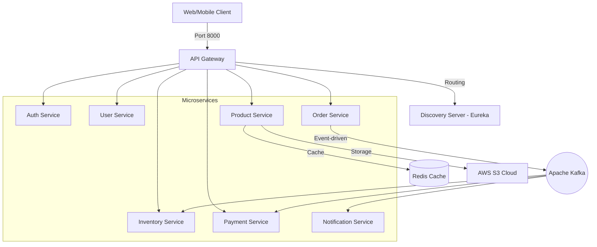

# 🎓 Cẩm Nang Kiến Thức Kiến Trúc Cloud-Native & Microservices

Tài liệu này tổng hợp toàn bộ kiến thức cốt lõi, giải pháp thiết kế kiến trúc và quyết định kỹ thuật được áp dụng trong dự án **Microservices E-Commerce**. Đây là cẩm nang hữu ích giúp bạn ôn luyện phỏng vấn mảng **Cloud / DevOps / Backend Engineer** và nắm bắt tư duy thiết kế hệ thống lớn.

---

## 🏛️ 1. Bản Đồ Kiến Trúc Hệ Thống (Architecture Map)

Dự án được xây dựng theo mô hình **Cloud-Native Microservices** hướng sự kiện (Event-Driven) bao gồm 9 dịch vụ chạy độc lập:



### Các thành phần chính:
*   **API Gateway (Port 9000 -> Map ra 8000):** Cổng vào duy nhất. Chịu trách nhiệm định tuyến động (Dynamic Routing), kiểm tra JWT tập trung và ẩn cấu trúc mạng nội bộ.
*   **Discovery Server (Eureka - Port 8761):** Trái tim của hệ thống. Giúp các microservices tự động đăng ký (Self-Registration) và tìm kiếm lẫn nhau (Service Discovery) bằng tên mà không cần cấu hình cứng IP.
*   **Apache Kafka:** Hệ thống truyền thông điệp dạng publish-subscribe giúp các dịch vụ giao tiếp bất đồng bộ, giảm thiểu liên kết cứng (Loose Coupling).

---

## 🛡️ 2. Độ Bền Bỉ Hệ Thống (Resilience & Fault Tolerance)

Trong hệ thống Microservices, **"Sập lỗi dây chuyền" (Cascading Failure)** là rủi ro lớn nhất khi một dịch vụ hạ nguồn bị chậm/sập kéo sập toàn bộ hệ thống. Dự án đã áp dụng các pattern đỉnh cao để giải quyết:

### A. Circuit Breaker (Bộ ngắt mạch - Resilience4j)
*   **Hoạt động:** Khi `user-service` hoặc `inventory-service` bị sập, Circuit Breaker phát hiện tỉ lệ lỗi vượt ngưỡng và chuyển sang trạng thái **OPEN** (Ngắt mạch). Các request tiếp theo sẽ lập tiếp kích hoạt hàm **Fallback Method** thay vì chờ đợi timeout, giúp bảo vệ `order-service` khỏi bị nghẽn RAM/Thread.
*   **Ứng dụng:** Tích hợp trực tiếp lên các Feign Clients giao tiếp nội bộ.

### B. Transactional Outbox Pattern (Nhất quán dữ liệu)
*   **Vấn đề (Dual-Write Problem):** Khi đặt hàng, hệ thống phải vừa ghi DB cục bộ vừa gửi Event báo sang Kafka. Nếu DB thành công nhưng Kafka bị sập, dữ liệu sẽ bị lệch.
*   **Giải pháp:** 
    1. Ghi đơn hàng mới đồng thời ghi một bản ghi Event vào bảng `outbox_events` trong **cùng một transaction** DB cục bộ (đảm bảo tính ACID).
    2. Một luồng chạy ngầm (`OutboxScheduler`) quét bảng này liên tục và publish sang Kafka.
    3. Khi Kafka xác nhận đã nhận thành công, scheduler mới đánh dấu event là đã gửi (`PROCESSED`).

---

## ☁️ 3. Tối Ưu Hóa Điện Toán Đám Mây (Cloud-Native & Container)

### A. Đóng Gói Docker Tối Ưu (Multi-Stage & JRE Base)
*   **Sự khác biệt:** Thay vì đóng gói Image chứa cả JDK (Java Development Kit) nặng nề (~500MB) và thừa thãi công cụ build, Dockerfile của toàn bộ 9 service sử dụng:
    ```dockerfile
    FROM eclipse-temurin:17-jre
    WORKDIR /app
    COPY target/*.jar app.jar
    ENTRYPOINT ["java", "-jar", "app.jar"]
    ```
*   **Lợi ích:** Dung lượng Image rút gọn xuống chỉ còn ~150MB, tối ưu tốc độ CI/CD, tiết kiệm băng thông và dung lượng lưu trữ trên Cloud Registry (như AWS ECR). Loại bỏ JDK giúp thu hẹp bề mặt tấn công bảo mật.

### B. Quản lý cấu hình Twelve-Factor App
*   **Spring Relaxed Binding:** Tuyệt đối không hardcode IP database hay AWS secret key. Tất cả được nạp động từ môi trường ngoài bằng Docker Compose qua các biến môi trường:
    *   `SPRING_DATASOURCE_URL`
    *   `SPRING_KAFKA_BOOTSTRAP_SERVERS`
    *   `EUREKA_CLIENT_SERVICEURL_DEFAULTZONE`
*   **AWS S3 Image Storage:** Lưu trữ hình ảnh sản phẩm tập trung trên đám mây AWS S3. Tích hợp thư viện `spring-dotenv` giúp nạp an toàn key bảo mật từ file `.env` (được đưa vào `.gitignore` để tránh rò rỉ lên GitHub).

---

## 💳 4. Thiết Kế Hóa Giải Lỗi Bên Thứ Ba (Mock Payment Gateway)

*   **Vấn đề:** Các cổng thanh toán bên thứ ba như VNPay Sandbox thường xuyên bị bảo trì hoặc lỗi mạng, làm nghẽn toàn bộ luồng kiểm thử đơn hàng.
*   **Giải pháp thiết kế:**
    *   Tạo interface `PaymentGateway` chung.
    *   Viết `MockPaymentGateway` gắn annotation `@Primary` để tự động ghi đè lên luồng VNPay cũ khi chạy thật.
    *   Hệ thống sinh ra URL Mock nội bộ. Khi truy cập, Mock Gateway tự động duyệt thanh toán thành công và bắn Event báo về Kafka để xử lý giao hàng ngay lập tức. Giúp việc test offline hoạt động 100% trơn tru.

---

## 📊 5. Hệ Thống Giám Sát (Observability Stack)

Hệ thống được tích hợp sẵn luồng giám sát chuẩn DevOps:
1.  **Spring Boot Actuator:** Thu thập các số liệu vận hành (JVM, bộ nhớ, số lượng HTTP request...) của từng service dưới dạng định dạng chuẩn Prometheus.
2.  **Prometheus (Time-series DB):** Đi thu thập dữ liệu (Pull metrics) từ các service định kỳ và lưu trữ lại.
3.  **Grafana:** Kết nối với Prometheus để vẽ lên các Dashboard đồ thị theo dõi sức khỏe hệ thống cực kỳ trực quan.

---

## 💡 6. Bộ Câu Hỏi Phỏng Vấn Nhanh (Cheat Sheet) Cho Bạn

> [!TIP]
> Hãy học thuộc các câu hỏi - trả lời này trước khi đi phỏng vấn mảng Cloud/DevOps để ghi điểm tuyệt đối:

### Q1: *"Làm thế nào để các microservices biết IP của nhau để gọi?"*
*   **Trả lời:** *"Dạ, chúng sử dụng Eureka Discovery Server. Khi khởi động, các service tự đăng ký tên của mình kèm IP/Port lên Eureka. Khi `order-service` muốn gọi `user-service`, nó sử dụng Feign Client với tên `@FeignClient(name = "user-service")`, Eureka sẽ tự động phân giải tên đó thành IP cụ thể ở thời điểm chạy."*

### Q2: *"Nếu container DB MySQL bị khởi động chậm hơn container ứng dụng Java thì sao?"*
*   **Trả lời:** *"Dạ, trong file `docker-compose.yml` em đã cấu hình `depends_on` cho các ứng dụng Java phụ thuộc vào các container Database và Eureka tương ứng. Đồng thời kết hợp cơ chế tự động kết nối lại (Auto-reconnection) của Spring Boot để đảm bảo ứng dụng không bị sập khi DB khởi động chậm."*

### Q3: *"Tại sao em lại dùng Outbox Pattern thay vì viết trực tiếp KafkaTemplate.send() trong Service?"*
*   **Trả lời:** *"Dạ, vì việc ghi DB và gửi tin nhắn sang Kafka là hai hành động ghi dữ liệu ở hai hệ thống khác nhau (Dual-write). Nếu viết trực tiếp, nếu mạng lỗi khiến Kafka gửi thất bại sau khi đã lưu DB, dữ liệu sẽ mất tính nhất quán. Outbox Pattern đảm bảo Event luôn được lưu cùng DB cục bộ, luồng scheduler chạy ngầm sẽ đảm bảo gửi thành công sang Kafka ít nhất một lần (At-least-once delivery)."*

---

## 🛠️ Phụ lục: Các câu lệnh vận hành nhanh 1-Click
1.  **Build toàn bộ file chạy `.jar` (Maven):**
    ```bash
    mvn clean package -DskipTests
    ```
2.  **Khởi chạy toàn bộ hệ thống Microservices + Hạ tầng:**
    ```bash
    docker compose up -d --build
    ```
3.  **Tắt toàn bộ hệ thống để giải phóng bộ nhớ RAM:**
    ```bash
    docker compose down
    ```
