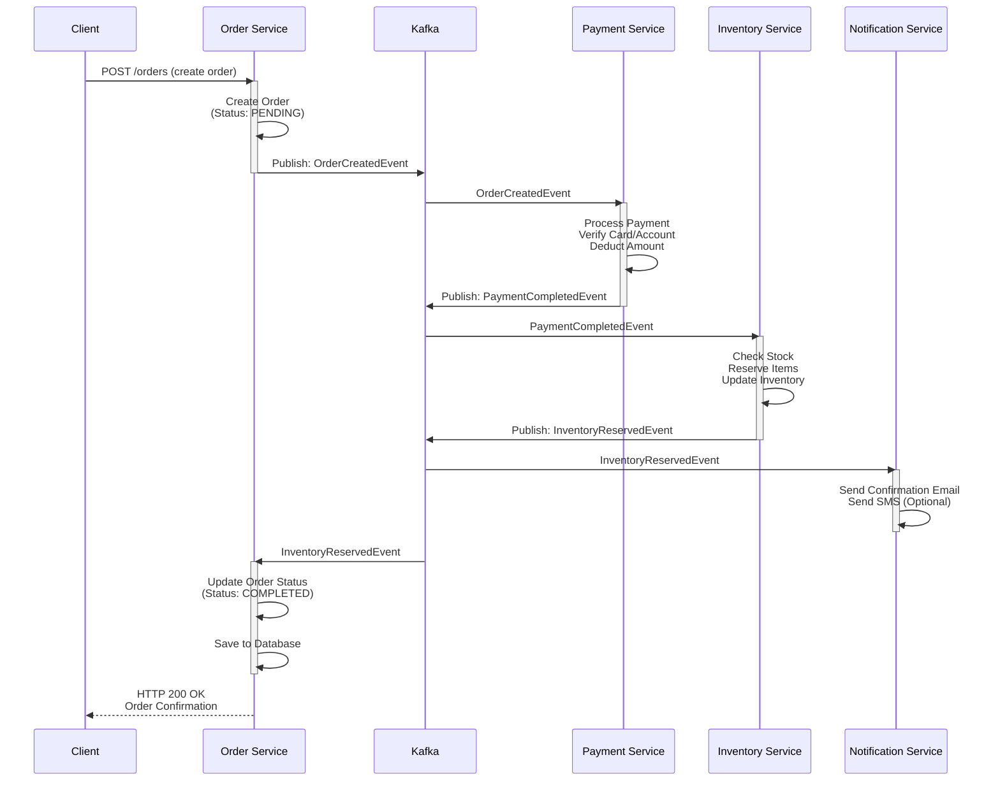
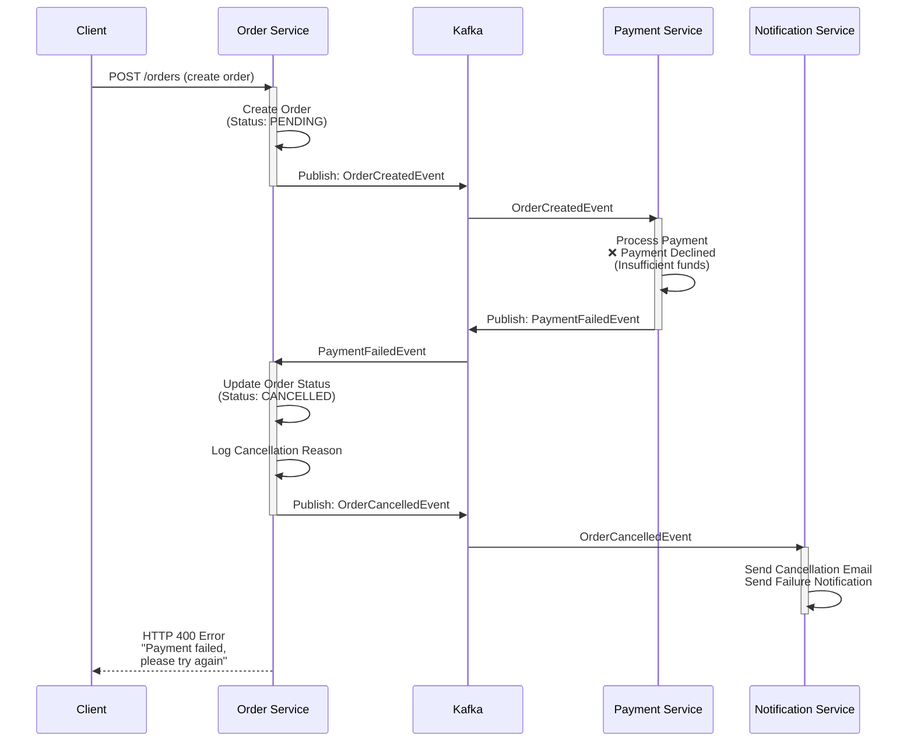
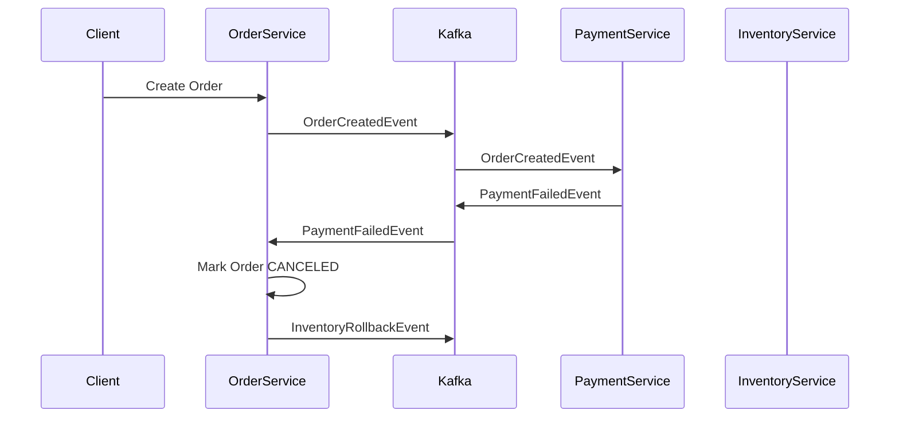

# 🛒 Microservices E-commerce System

## 📌 Overview

This project is a **production-grade microservices-based e-commerce backend system** built with **Spring Boot 3.5.8** and **Spring Cloud 2025.0.0**. It demonstrates enterprise-level backend architecture principles including:

- ✅ **Service-Oriented Architecture (SOA)** - Multiple independent microservices
- ✅ **Event-Driven Communication** - Asynchronous processing via Apache Kafka
- ✅ **Saga Pattern** - Distributed transaction handling for order processing
- ✅ **API Gateway Pattern** - Centralized entry point with routing and security
- ✅ **Service Discovery** - Dynamic service registration via Eureka
- ✅ **Database-per-Service** - Independent data storage for each service
- ✅ **JWT Authentication** - Secure inter-service communication
- ✅ **Containerization** - Docker Compose for local development

---

## 🧱 Architecture Overview

### 📐 High-level System Architecture

```
┌─────────────┐
│   Client    │
└──────┬──────┘
       │ HTTP
       ▼
┌─────────────────────────┐
│   API Gateway           │  (Port: 8000)
│   - JWT Validation      │  - Service Routing
│   - Request Filtering   │  - Load Balancing
└──────┬──────────────────┘
       │
       ├─────────────────────┬─────────────────┬──────────────────┐
       ▼                     ▼                 ▼                  ▼
    ┌──────────┐        ┌──────────┐     ┌──────────┐      ┌──────────┐
    │  Auth    │        │  User    │     │ Product  │      │  Order   │
    │ Service  │        │ Service  │     │ Service  │      │ Service  │
    │ MySQL:3309       │ Postgres │     │ MySQL:3306      │ MySQL:3307
    └──────────┘        └──────────┘     └──────────┘      └──────────┘
                                                                  │
       ┌────────────────────────────────────────────────────────┘
       │
       ▼
    ┌──────────────────────────────────────────┐
    │   Apache Kafka (Event Bus)               │
    │   - OrderCreatedEvent                    │
    │   - PaymentCompletedEvent                │
    │   - InventoryUpdatedEvent                │
    │   - NotificationEvent                    │
    └──────────────────────────────────────────┘
       │     │           │           │
       ▼     ▼           ▼           ▼
    ┌─────────┐  ┌──────────┐  ┌───────────┐  ┌────────────────┐
    │Payment  │  │Inventory │  │ Notif.    │  │ Discovery      │
    │Service  │  │ Service  │  │ Service   │  │ Server (Eureka)│
    │MySQL:3310  │MySQL:3308   │           │  │                │
    └─────────┘  └──────────┘  └───────────┘  └────────────────┘

    ┌─────────────────────────────────────────┐
    │   Infrastructure Services               │
    │   - Redis Cache (Port: 6379)            │
    │   - Prometheus Monitoring               │
    │   - Zookeeper (Kafka Coordinator)       │
    └─────────────────────────────────────────┘
```

### 🔹 Microservices Overview

| Service | Port | Database | Purpose |
|---------|------|----------|---------|
| **api-gateway** | 8000 | - | Entry point, routing, JWT validation, rate limiting |
| **discovery-server** | 8761 | - | Service registry (Eureka) for dynamic service discovery |
| **auth-service** | 8001 | MySQL:3309 | Authentication, JWT token generation, credential validation |
| **user-service** | 8002 | PostgreSQL:5432 | User profile management, registration, user information |
| **product-service** | 8003 | MySQL:3306 | Product catalog, search, product details, pricing |
| **order-service** | 8004 | MySQL:3307 | Order management, order orchestration, saga coordination |
| **payment-service** | 8005 | MySQL:3310 | Payment processing, transaction handling, payment status |
| **inventory-service** | 8006 | MySQL:3308 | Stock management, inventory updates, availability checks |
| **notification-service** | 8007 | - | Email/SMS notifications, event notifications |
| **mcp-server** | - | - | MCP (Model Context Protocol) server for AI integration |

---

## 🔁 Communication Patterns

### 📡 Synchronous Communication (OpenFeign)

**Used for:** Request-response interactions between services
- Service-to-service API calls
- Read operations (e.g., Order Service → Product Service for product details)
- Validation checks
- Real-time data retrieval

```
Order Service --HTTP--> Product Service (Get product price)
Auth Service  --HTTP--> User Service (Verify user)
```

### 🔔 Asynchronous Communication (Apache Kafka)

**Used for:** Event-driven workflows
- Order processing pipeline
- Payment notifications
- Inventory updates
- Email/SMS notifications
- Decoupling services
- Improving system resilience

**Key Topics:**
- `order-events` - Order creation and status changes
- `payment-events` - Payment processing events
- `inventory-events` - Stock updates
- `notification-events` - User notifications

---

## 🔄 Saga Pattern – Order Processing Flow

### Order Processing Workflow

The system implements a **choreography-based Saga pattern** for distributed transactions:

```
┌─────────────────────────────────────────────────────────────────┐
│                    Order Processing Saga                         │
└─────────────────────────────────────────────────────────────────┘

1️⃣  Client submits order
    ↓
2️⃣  Order Service:
    - Creates order (Status: PENDING)
    - Publishes OrderCreatedEvent
    ↓
3️⃣  Payment Service (listening to OrderCreatedEvent):
    - Processes payment
    - If SUCCESS → PaymentCompletedEvent
    - If FAILED → OrderCancelledEvent
    ↓
4️⃣  Inventory Service (listening to PaymentCompletedEvent):
    - Reserves stock
    - If SUCCESS → InventoryReservedEvent
    - If FAILED → OrderCancelledEvent (Payment refunded)
    ↓
5️⃣  Notification Service (listening to events):
    - Sends confirmation emails
    - Sends shipping notifications
    ↓
6️⃣  Order Service (listening to InventoryReservedEvent):
    - Updates order status to COMPLETED
    - Returns confirmation to client
```

### Failure Handling (Compensating Transactions)

If any step fails:
- **Payment fails** → Order remains PENDING, can be retried
- **Inventory fails** → Payment is refunded, order CANCELLED
- **Notification fails** → Logged for manual retry

### 🟢 Successful Payment Flow (Sequence Diagram)



**Flow Summary:**
1. ✅ Client submits order
2. ✅ Order Service creates order (PENDING) → publishes OrderCreatedEvent
3. ✅ Payment Service processes payment → publishes PaymentCompletedEvent
4. ✅ Inventory Service reserves stock → publishes InventoryReservedEvent
5. ✅ Notification Service sends confirmation
6. ✅ Order Service marks order COMPLETED → responds to client

---

### 🔴 Failed Payment Flow (Sequence Diagram)



**Flow Summary:**
1. ❌ Client submits order
2. ❌ Order Service creates order (PENDING) → publishes OrderCreatedEvent
3. ❌ Payment Service payment declined → publishes PaymentFailedEvent
4. ❌ Order Service cancels order → publishes OrderCancelledEvent
5. ❌ Notification Service sends failure notification
6. ❌ Order Service responds with error message

---

## 🏗️ Project Structure

```
microservices-ecommerce/
├── api-gateway/              # Spring Cloud Gateway
│   ├── src/main/java/
│   │   └── com/fit/apigateway/
│   │       ├── config/        # Gateway routing config
│   │       ├── filter/        # JWT validation filters
│   │       └── controller/    # API endpoints
│   └── pom.xml
│
├── discovery-server/         # Eureka Service Discovery
│   ├── src/main/java/
│   │   └── com/fit/discovery/
│   └── pom.xml
│
├── auth-service/             # Authentication Service
│   ├── src/main/java/
│   │   └── com/fit/auth/
│   │       ├── entity/        # User credentials
│   │       ├── service/       # Auth logic, JWT
│   │       └── controller/    # Auth endpoints
│   └── pom.xml
│
├── user-service/             # User Management
│   ├── src/main/java/
│   │   └── com/fit/user/
│   └── pom.xml
│
├── product-service/          # Product Catalog
│   ├── Dockerfile            # Docker image
│   ├── src/main/java/
│   │   └── com/fit/product/
│   │       ├── entity/        # Product model
│   │       ├── repository/    # Data access
│   │       └── controller/    # REST API
│   └── pom.xml
│
├── order-service/            # Order Processing (Saga Orchestrator)
│   ├── src/main/java/
│   │   └── com/fit/order/
│   │       ├── entity/        # Order model
│   │       ├── event/         # Event definitions
│   │       ├── saga/          # Saga orchestration
│   │       └── controller/    # REST API
│   └── pom.xml
│
├── payment-service/          # Payment Processing
│   ├── src/main/java/
│   │   └── com/fit/payment/
│   └── pom.xml
│
├── inventory-service/        # Stock Management
│   ├── src/main/java/
│   │   └── com/fit/inventory/
│   └── pom.xml
│
├── notification-service/     # Notifications
│   ├── src/main/java/
│   │   └── com/fit/notification/
│   └── pom.xml
│
├── mcp-server/              # MCP Server
│   ├── src/main/java/
│   └── pom.xml
│
├── docker-compose.yml        # Docker containers setup
├── prometheus.yml            # Prometheus monitoring config
├── pom.xml                   # Parent Maven POM
└── README.md                # This file
```

---

## 🚀 Quick Start

### Prerequisites

- **Java 17+**
- **Maven 3.8+**
- **Docker & Docker Compose**
- **Git**

### Installation & Setup

#### 1. Clone the Repository
```bash
git clone https://github.com/KhanhLanBui03/microservices-ecommerce.git
cd microservices-ecommerce
```

#### 2. Start Infrastructure (Docker Compose)
```bash
docker-compose up -d
```

This will start:
- 5x MySQL instances (product, order, payment, auth, inventory)
- 1x PostgreSQL instance (user service)
- Apache Kafka + Zookeeper
- Redis cache
- All services will be accessible after full startup

#### 3. Build the Project
```bash
mvn clean install
```

#### 4. Run Each Service (in separate terminals)

**Discovery Server (Must start first - port 8761)**
```bash
cd discovery-server
mvn spring-boot:run
```

**API Gateway (port 8000)**
```bash
cd api-gateway
mvn spring-boot:run
```

**Auth Service (port 8001)**
```bash
cd auth-service
mvn spring-boot:run
```

**User Service (port 8002)**
```bash
cd user-service
mvn spring-boot:run
```

**Product Service (port 8003)**
```bash
cd product-service
mvn spring-boot:run
```

**Order Service (port 8004)**
```bash
cd order-service
mvn spring-boot:run
```

**Payment Service (port 8005)**
```bash
cd payment-service
mvn spring-boot:run
```

**Inventory Service (port 8006)**
```bash
cd inventory-service
mvn spring-boot:run
```

**Notification Service (port 8007)**
```bash
cd notification-service
mvn spring-boot:run
```

### Verification

- **API Gateway:** http://localhost:8000
- **Eureka Dashboard:** http://localhost:8761
- **Kafka Topics:** Check via `docker exec kafka kafka-topics --list --bootstrap-server localhost:9092`

---

## 🔐 Security

- **JWT Authentication** - All API calls require valid JWT token
- **API Gateway Filtering** - Validates tokens before routing
- **Service-to-Service Auth** - Inter-service calls include credentials
- **HTTPS Ready** - Can be deployed with SSL/TLS

### Getting JWT Token

```bash
curl -X POST http://localhost:8001/auth/login \
  -H "Content-Type: application/json" \
  -d '{"username":"admin","password":"password"}'
```

---

## 📊 Database Schema

### MySQL Services (product, order, payment, auth, inventory)
- InnoDB storage engine
- Character set: UTF-8
- Credentials: appuser / apppassword
- Root password: root

### PostgreSQL (user service)
- Version: 15
- Credentials: postgres / postgres
- Database: user_service

---

## 🧪 Testing

### Run Unit Tests
```bash
mvn test
```

### Run Integration Tests with JUnit & Mockito
```bash
mvn verify
```

**Current Branch:** `feat/jUnit-Mockito` - Contains enhanced unit tests using JUnit and Mockito

---

## 📈 Monitoring & Observability

### Prometheus Metrics
- Configuration: `prometheus.yml`
- Metrics endpoint: `/actuator/prometheus`
- Access dashboard: http://localhost:9090 (if Prometheus is running)

### Application Metrics Tracked
- HTTP request counts and latencies
- Database query performance
- Kafka message processing times
- JVM memory and CPU usage

### Logs
Each service logs to:
- Console output
- Application log files (configurable in application.yml)

---

## 🔧 Technology Stack

| Component | Technology | Version |
|-----------|-----------|---------|
| **Java Runtime** | JDK/OpenJDK | 17 LTS |
| **Framework** | Spring Boot | 3.5.8 |
| **Cloud Framework** | Spring Cloud | 2025.0.0 |
| **API Gateway** | Spring Cloud Gateway | 2025.0.0 |
| **Service Discovery** | Eureka | - |
| **Message Broker** | Apache Kafka | 7.4.4 |
| **Primary DB** | MySQL | 8.3.0 |
| **Alternative DB** | PostgreSQL | 15 |
| **Cache** | Redis | 7 |
| **ORM** | Spring Data JPA | 3.5.8 |
| **HTTP Client** | OpenFeign | 2025.0.0 |
| **Testing** | JUnit 5, Mockito | Latest |
| **Container** | Docker | Latest |
| **Orchestration** | Docker Compose | 3.9 |
| **Build Tool** | Maven | 3.8+ |

---

## 📝 API Endpoints

### Authentication (Auth Service)
```
POST /auth/register          - Register new user
POST /auth/login             - Get JWT token
POST /auth/validate          - Validate token
POST /auth/refresh           - Refresh JWT token
```

### User Management (User Service)
```
GET  /users/{userId}         - Get user profile
PUT  /users/{userId}         - Update user profile
DELETE /users/{userId}       - Delete user account
GET  /users                  - List all users (admin)
```

### Products (Product Service)
```
GET  /products               - List all products
GET  /products/{productId}   - Get product details
POST /products               - Create product (admin)
PUT  /products/{productId}   - Update product (admin)
DELETE /products/{productId} - Delete product (admin)
```

### Orders (Order Service)
```
POST /orders                 - Create new order
GET  /orders/{orderId}       - Get order details
GET  /orders/user/{userId}   - List user orders
PUT  /orders/{orderId}/cancel - Cancel order
GET  /orders                 - List all orders (admin)
```

### Payments (Payment Service)
```
POST /payments               - Process payment
GET  /payments/{paymentId}   - Get payment status
```

### Inventory (Inventory Service)
```
GET  /inventory/{productId}  - Check stock level
POST /inventory/reserve      - Reserve stock
POST /inventory/release      - Release stock
```

---

## 🤝 Contributing

1. Create a feature branch: `git checkout -b feature/your-feature`
2. Commit changes: `git commit -m "Add feature"`
3. Push to branch: `git push origin feature/your-feature`
4. Open a Pull Request

---

## 📄 License

This project is provided as-is for educational and development purposes.

---

## 👨‍💻 Author

**KhanhLanBui03** - Microservices E-commerce System

---

## 📚 Resources & References

- [Spring Boot Documentation](https://spring.io/projects/spring-boot)
- [Spring Cloud Documentation](https://spring.io/projects/spring-cloud)
- [Apache Kafka Documentation](https://kafka.apache.org/documentation/)
- [Microservices Patterns](https://microservices.io/patterns/index.html)
- [Saga Pattern for Distributed Transactions](https://microservices.io/patterns/data/saga.html)

---

## ❓ Troubleshooting

### Services not registering in Eureka
- Ensure Discovery Server is running first
- Check network connectivity
- Verify service configuration

### Kafka connection issues
- Ensure Zookeeper and Kafka are running: `docker-compose ps`
- Check Kafka broker logs: `docker logs kafka`

### Database connection errors
- Verify Docker containers are running: `docker-compose ps`
- Check credentials in application.yml files
- Ensure port mappings are correct

---

**Last Updated:** January 2026  
**Status:** Active Development

### 🔴 Failed Payment Flow (Sequence Diagram)



Kafka events are used to ensure **eventual consistency** across services.

---

## 💳 Payment Service (Deep Dive)

* Payment state machine:

  ```
  PENDING → PROCESSING → SUCCESS / FAILED
  ```
* Idempotent consumer handling duplicate Kafka events
* Asynchronous payment simulation using Kafka
* Emits domain events:

    * PaymentCompletedEvent
    * PaymentFailedEvent

---

## 🔐 Security

* JWT-based authentication
* Centralized security via **API Gateway**
* Role-based access control (ADMIN / USER)
* Token validation handled at gateway layer

---

## 🗄️ Database

* **MySQL** & **PostgreSQL**
* Each microservice owns its schema
* JPA & Hibernate for ORM

---

## 🧪 Testing

* Unit tests for business logic
* WebMvc tests for REST controllers
* Kafka consumer logic tested with mock events

---

## 📊 Monitoring & Observability

* **Prometheus** for metrics collection
* **Grafana** for visualization
* Application metrics exposed via Spring Actuator

---

## 🐳 Docker & Deployment

* All services containerized using **Docker**
* **Docker Compose** for local development

```bash
docker-compose up -d
```

---

## 🗂 Project Structure

```
microservices-ecommerce
├── api-gateway
├── auth-service
├── discovery-server
├── user-service
├── product-service
├── order-service
├── payment-service
├── inventory-service
├── notification-service
├── docker-compose.yml
├── prometheus.yml
└── README.md
```

---

## 🛠 Tech Stack

* Java 17
* Spring Boot
* Spring Cloud (Eureka, OpenFeign, Gateway)
* Apache Kafka
* Spring Security + JWT
* JPA / Hibernate
* MySQL / PostgreSQL
* Docker & Docker Compose
* Prometheus & Grafana
* JUnit / Mockito

---

## 🎯 Learning Objectives

This project focuses on:

* Designing scalable microservices architecture
* Event-driven communication using Kafka
* Distributed transaction handling with Saga Pattern
* Backend security & authentication
* Observability and monitoring
* Writing testable and maintainable backend code

---

## 🚀 Future Improvements

* Outbox Pattern for reliable event publishing
* Dead Letter Queue (DLQ) for Kafka
* Distributed tracing (Zipkin / Tempo)
* Rate limiting at API Gateway

---

## 👤 Author

**Bùi Khánh Lân**
Java Backend Developer (Intern / Fresher)

---

