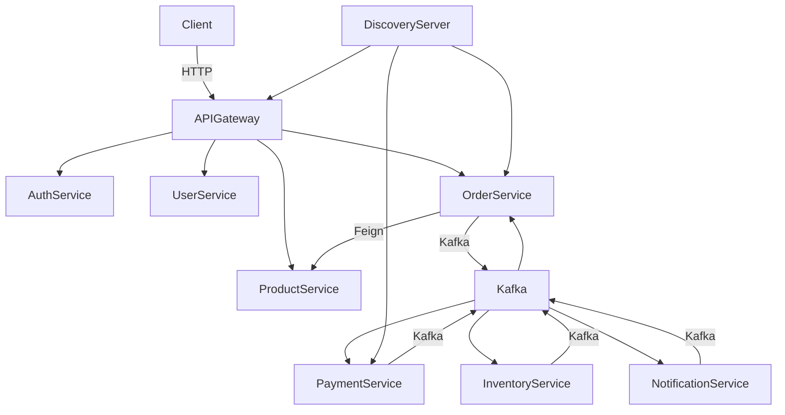
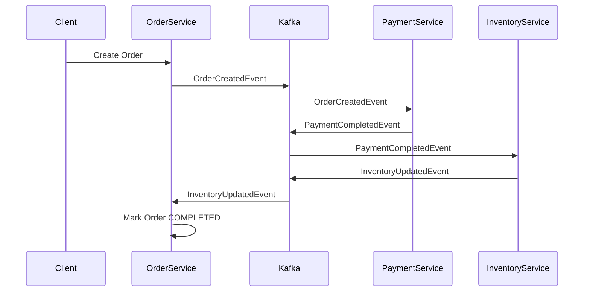
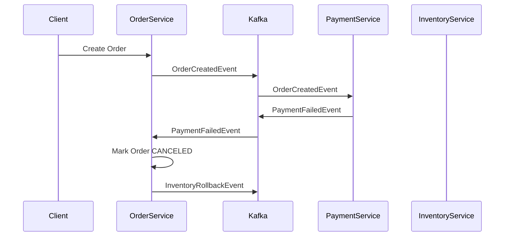

# 🛒 Microservices E-commerce System

## 📌 Overview

This project is a **microservices-based e-commerce backend system** built with **Spring Boot & Spring Cloud**, focusing on **real-world backend architecture**, **event-driven communication**, and **distributed transaction handling using Saga Pattern**.

The project is designed as a **personal learning & portfolio project** to demonstrate backend engineering skills at **Intern strong → Fresher level**, including system design, asynchronous messaging, security, testing, and monitoring.

---

## 🧱 Architecture Overview

### 📐 High-level Architecture Diagram



### 🔹 Microservices

The system is composed of the following services:

| Service              | Responsibility                        |
| -------------------- | ------------------------------------- |
| api-gateway          | Entry point, routing, JWT validation  |
| auth-service         | Authentication, JWT issuing           |
| user-service         | User management                       |
| product-service      | Product information                   |
| order-service        | Order creation & orchestration (Saga) |
| payment-service      | Payment processing (simulated)        |
| inventory-service    | Stock management                      |
| notification-service | Send notifications                    |
| discovery-server     | Service discovery (Eureka)            |

Each service has **its own database** (Database-per-service pattern).

------|---------------|
| api-gateway | Entry point, routing, JWT validation |
| auth-service | Authentication, JWT issuing |
| user-service | User management |
| product-service | Product information |
| order-service | Order creation & orchestration (Saga) |
| payment-service | Payment processing (simulated) |
| inventory-service | Stock management |
| notification-service | Send notifications |
| discovery-server | Service discovery (Eureka) |

Each service has **its own database** (Database-per-service pattern).

---

## 🔁 Communication Patterns

### ✅ Synchronous Communication

* **OpenFeign** is used for request-response interactions
* Applied for:

    * Read operations
    * Validation scenarios

### ✅ Asynchronous Communication

* **Apache Kafka** is used for event-driven communication
* Applied for:

    * Order processing
    * Payment handling
    * Inventory update
    * Notifications

---

## 🔄 Saga Pattern – Order Processing Flow

### 🟢 Successful Order Flow (Sequence Diagram)



### 🔴 Failed Payment Flow (Sequence Diagram)



Kafka events are used to ensure **eventual consistency** across services.

---

## 💳 Payment Service (Deep Dive)

* Payment state machine:

  ```
  PENDING → PROCESSING → SUCCESS / FAILED
  ```
* Idempotent consumer handling duplicate Kafka events
* Asynchronous payment simulation using Kafka
* Emits domain events:

    * PaymentCompletedEvent
    * PaymentFailedEvent

---

## 🔐 Security

* JWT-based authentication
* Centralized security via **API Gateway**
* Role-based access control (ADMIN / USER)
* Token validation handled at gateway layer

---

## 🗄️ Database

* **MySQL** & **PostgreSQL**
* Each microservice owns its schema
* JPA & Hibernate for ORM

---

## 🧪 Testing

* Unit tests for business logic
* WebMvc tests for REST controllers
* Kafka consumer logic tested with mock events

---

## 📊 Monitoring & Observability

* **Prometheus** for metrics collection
* **Grafana** for visualization
* Application metrics exposed via Spring Actuator

---

## 🐳 Docker & Deployment

* All services containerized using **Docker**
* **Docker Compose** for local development

```bash
docker-compose up -d
```

---

## 🗂 Project Structure

```
microservices-ecommerce
├── api-gateway
├── auth-service
├── discovery-server
├── user-service
├── product-service
├── order-service
├── payment-service
├── inventory-service
├── notification-service
├── docker-compose.yml
├── prometheus.yml
└── README.md
```

---

## 🛠 Tech Stack

* Java 17
* Spring Boot
* Spring Cloud (Eureka, OpenFeign, Gateway)
* Apache Kafka
* Spring Security + JWT
* JPA / Hibernate
* MySQL / PostgreSQL
* Docker & Docker Compose
* Prometheus & Grafana
* JUnit / Mockito

---

## 🎯 Learning Objectives

This project focuses on:

* Designing scalable microservices architecture
* Event-driven communication using Kafka
* Distributed transaction handling with Saga Pattern
* Backend security & authentication
* Observability and monitoring
* Writing testable and maintainable backend code

---

## 🚀 Future Improvements

* Outbox Pattern for reliable event publishing
* Dead Letter Queue (DLQ) for Kafka
* Distributed tracing (Zipkin / Tempo)
* Rate limiting at API Gateway

---

## 👤 Author

**Bùi Khánh Lân**
Java Backend Developer (Intern / Fresher)

---

